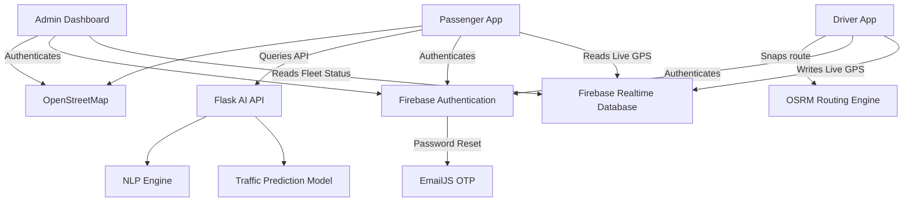
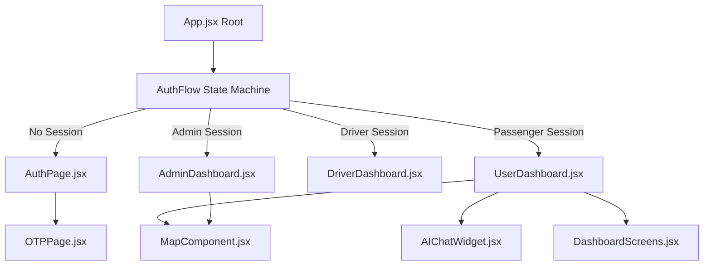
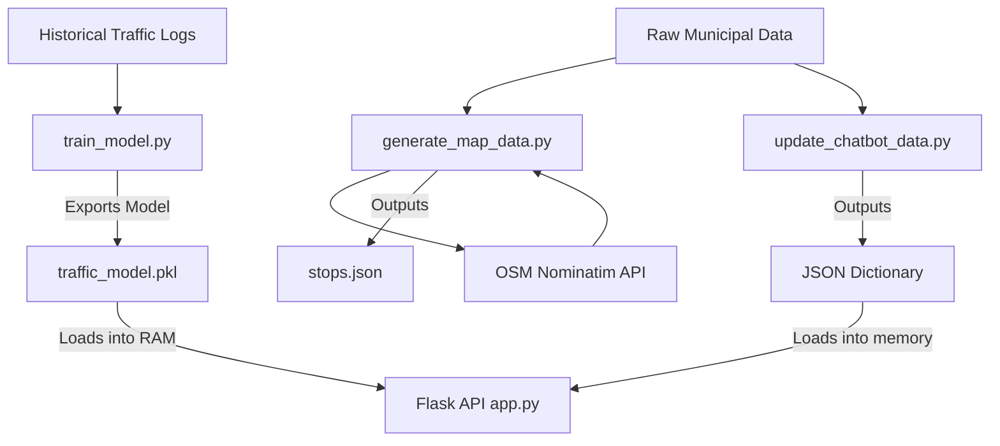
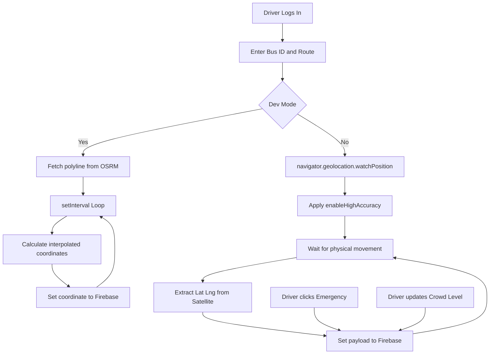

# RTC Live: Architecture Flowcharts

This document provides visual representations of the RTC Live architecture.

## 1. High-Level System Architecture

---

## 2. Frontend Component Routing and State

---

## 3. Backend AI and Data ETL Pipeline

---

## 4. Driver Telemetry Engine

